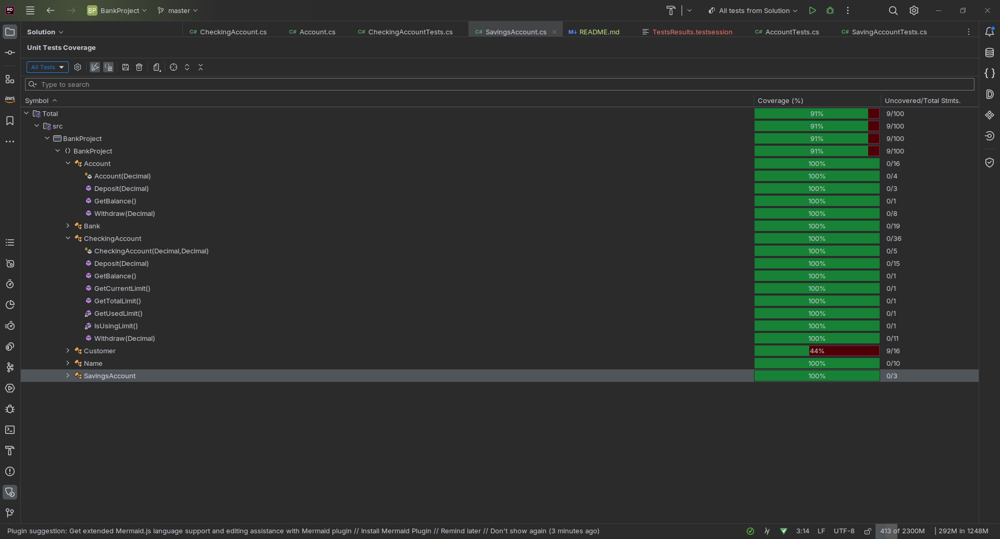

# Bank Project

## Unit Tests Results

```
tests (26 tests) Success
  BankTests (26 tests) Success
    BankTests (26 tests) Success
      AccountTests (4 tests) Success
        Balance_ShouldReturn_ActualAccountBalance Success
        Deposit_ShouldIncrementBalance_WithValidAmount Success
        Withdraw_SholdReturnFalse_WhenAccountHasntEnoughBalance Success
        Withdraw_ShouldReturnFalse_WhenAccountHasEnoughBalance Success
      BankTests (5 tests) Success
        Add_NullCustomer_ThrowsException Success
        Add_ValidCustomer_InsertsInList Success
        GetCustomer_WithInvalidPosition_ThrowsException Success
        GetCustomer_WithValidPosition_ReturnsCustomer Success
        Name_Returns_CorrectName Success
      CheckingAccountTests (5 tests) Success
        Deposit_ShouldIncrementBalance_WhenAmountExceedsNegativeBalance (2 tests) Success
          Deposit_ShouldIncrementBalance_WhenAmountExceedsNegativeBalance(negativeBalance: 500, limit: 500, amount: 1000, expected: 1000) Success
          Deposit_ShouldIncrementBalance_WhenAmountExceedsNegativeBalance(negativeBalance: 500, limit: 500, amount: 500, expected: 500) Success
        Deposit_ShouldIncrementBalance_WhenAmountIsValid (3 tests) Success
          Deposit_ShouldIncrementBalance_WhenAmountIsValid(initialBalance: 0, limit: 0, amount: 1000, expected: 1000) Success
          Deposit_ShouldIncrementBalance_WhenAmountIsValid(initialBalance: 0, limit: 500, amount: 1000, expected: 1500) Success
          Deposit_ShouldIncrementBalance_WhenAmountIsValid(initialBalance: 500, limit: 500, amount: 1000, expected: 2000) Success
      CheckingAccountWithdrawTests (4 tests) Success
        Withdraw_ShouldDecrementBalance_WhenAccountHasFunds (3 tests) Success
          Withdraw_ShouldDecrementBalance_WhenAccountHasFunds(initialBalance: 1000, limit: 0, widthdrawAmount: 1000, expectedBalance: 0, expectedLimit: 0) Success
          Withdraw_ShouldDecrementBalance_WhenAccountHasFunds(initialBalance: 1000, limit: 500, widthdrawAmount: 1000, expectedBalance: 500, expectedLimit: 500) Success
          Withdraw_ShouldDecrementBalance_WhenAccountHasFunds(initialBalance: 500, limit: 500, widthdrawAmount: 1000, expectedBalance: 0, expectedLimit: 0) Success
        Withdraw_ShouldReturnFalse_WhenAccountHasntEnoughBalance Success
      NameTests (4 tests) Success
        Create_WithInvalidMaxLength_ThrowsArgumentException Success
        Create_WithInvalidMinLength_ThrowsArgumentException Success
        Create_WithValidNames_ReturnsInstance Success
        ToString_Returns_Name Success
      SavingAccountTests (4 tests) Success
        AccountTests.Balance_ShouldReturn_ActualAccountBalance Success
        AccountTests.Deposit_ShouldIncrementBalance_WithValidAmount Success
        AccountTests.Withdraw_SholdReturnFalse_WhenAccountHasntEnoughBalance Success
        AccountTests.Withdraw_ShouldReturnFalse_WhenAccountHasEnoughBalance Success

```

## Tests Coverage Results

[Click here to interactive code coverage results](Coverage.html)




